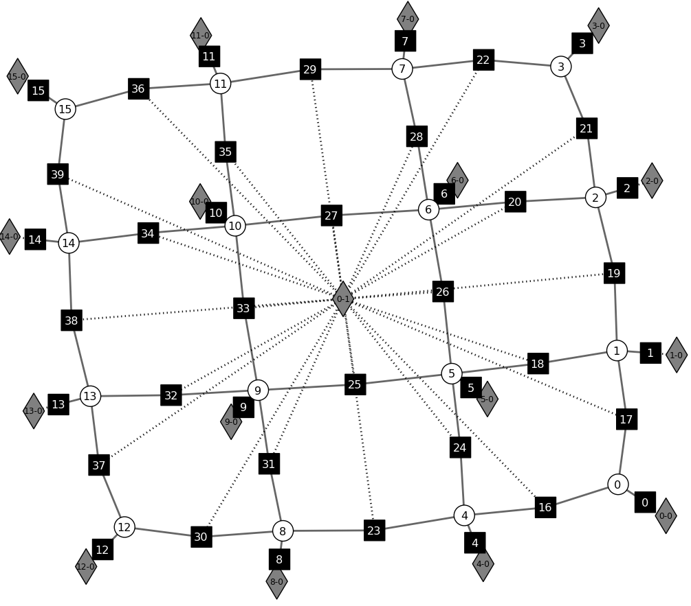
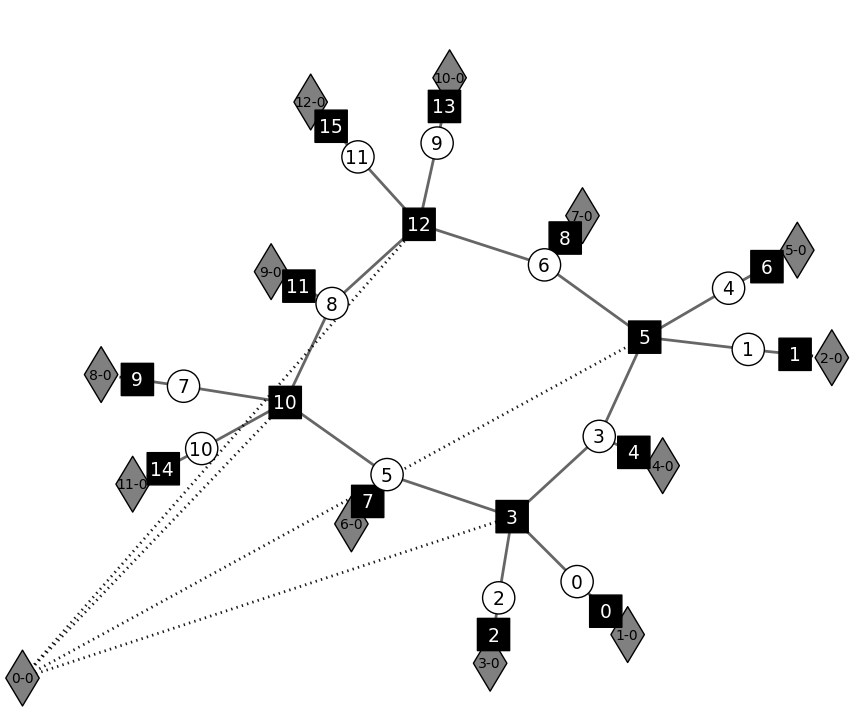
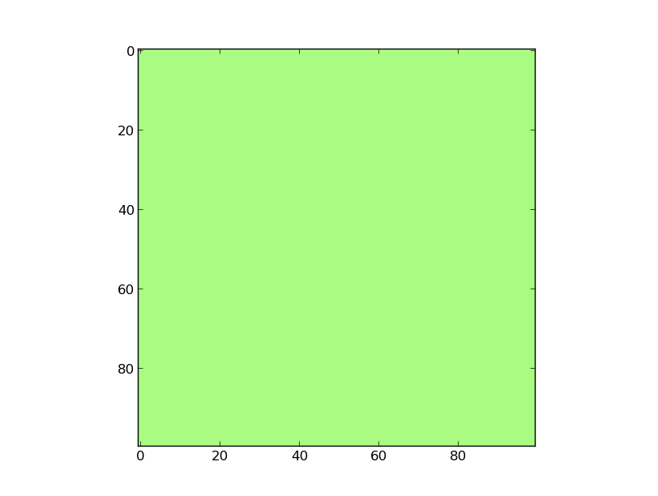
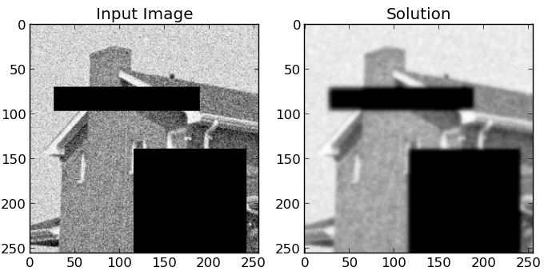

Markov Chain
-----------------   
This example builds a Markov Chain

Code
++++++++++++++++++++++++++++++++++++++
.. literalinclude:: ../../examples/markov_chain.py

Extended Factor Graph
++++++++++++++++++++++++++++++++++++++
An auto-generated [#soon_in_repo]_  graph [#legend]_ for this graphical model.

.. seealso::
    :func:`opengm.visualizeGm` :func:`opengm.__init__.grid2d2Order` :func:`opengm.grid2d2Order`

Potts Model
---------------------------------------------------   
This example builds a Potts model on a two dimensional grid

Code
++++++++++++++++++++++++++++++++++++++
.. literalinclude:: ../../examples/potts_model.py

Extended Factor Graph
++++++++++++++++++++++++++++++++++++++
An auto-generated [#soon_in_repo]_  graph [#legend]_ for this graphical model.

Legend: [#legend]_

Interpixel-Boundary Segmentation'-Model
-----------------   
This example builds a 'interpixel-boundary segmentation' model on a two dimensional grid

.. note::

    TODO: show input and output image for different betas !

Code
++++++++++++++++++++++++++++++++++++++
.. literalinclude:: ../../examples/interpixel_boundary_segmentation.py

Extended Factor Graph
++++++++++++++++++++++++++++++++++++++
An auto-generated [#soon_in_repo]_  graph [#legend]_ for this graphical model.

Legend: [#legend]_

Pure Python ICM Solver
-----------------   
This example show how to write inference solvers in python, and shows the usage of the movemaker

Code
++++++++++++++++++++++++++++++++++++++
.. literalinclude:: ../../examples/pure_python_icm.py

Iterate over a factors value table with a 'shapeWalker'
-----------------   
This example show how to iterate over all possible labelings of a factor 

.. literalinclude:: ../../examples/shape_walker.py

Pure Python Visitors
-----------------   
This example shows how to write a pure python visitor for inference.
In this example the current state of the solver is reshaped as
a 2d image since the model is a 2d grid.

Code
++++++++++++++++++++++++++++++++++++++
.. literalinclude:: ../../examples/python_visitor_gui.py

Inference Animation
++++++++++++++++++++++++++++++++++++++

.. rubric:: Footnotes
.. [#soon_in_repo] Based on networkx and graphviz, the code will be in the opengm repo. soon  
.. [#legend] White circles are the variables, black boxes are factors and the gray diamonds are the functions.

MRF - Benchmark
-------------------
`Mrf-Benchmark <http://vision.middlebury.edu/MRF/code/>`_ Models implemented in Opengm Python:

Stereo matching problems:
++++++++++++++++++++++++++++++++++++
.. note::

   This example will be there soon.

Photomontage problems:
++++++++++++++++++++++++++++++++++++
.. note::

   This example will be there soon.

Binary image segmentation problems:
++++++++++++++++++++++++++++++++++++
.. note::

   This example will be there soon.

Denoising and Inpainting problems:
++++++++++++++++++++++++++++++++++++
.. note::

Code:
************************************
.. literalinclude:: ../../examples/mrf/denoise.py

Result:
************

    This is the result if icm is used as a solver.
    The model has 50 Labels, and a weight of 5.0.
    No truncation has been used.